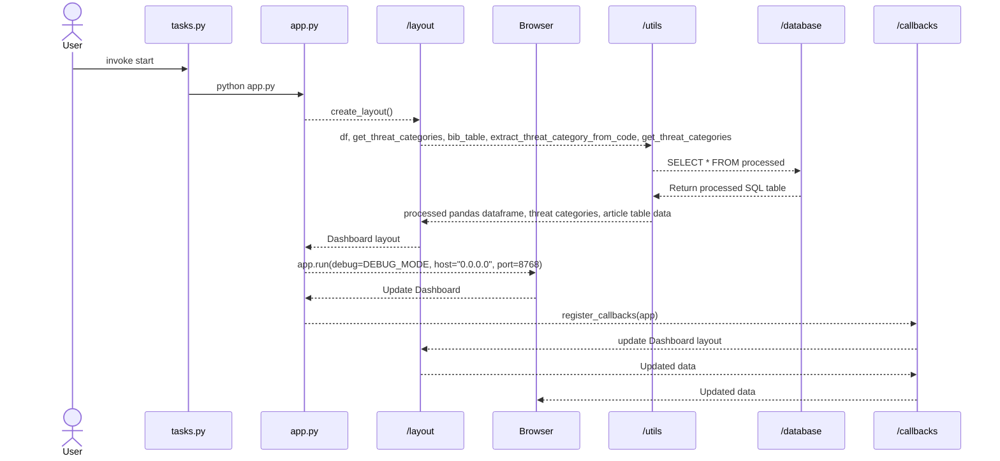

# Dashboard Architecture

## File Structure & Responsibilities

### Core Application Files

**`app.py`** - Main entry point
- Initializes Dash application
- Combines layout + callbacks
- Run: `python app.py`

**`tasks.py`** - Add invoke commands, especially useful for long command line inputs

**`config.py`** - Configuration & constants
- Data file paths
- Column mappings
- App settings (title, debug mode, etc.)

**`layout.py`** - UI structure
- Defines dashboard layout (navbar, sidebar, main content)
- All visual components (dropdowns, charts, map containers)

**`callbacks.py`** - Interactivity logic
- Handles user interactions (filters, clicks, updates)
- Connects UI components to data updates

### Data & Processing

**`utils/data_loader.py`** - Data loading
- Ridley dataset
- Cleans column names
- Exports: `df_grossi`, `df`

### Visualizations

**`visualizations/charts.py`** - Chart creation
- Functions to create Plotly charts
- Reusable visualization components

**`sections/overview.py`** - Overview section layout
**`sections/data_section.py`** - Data table section layout

## Quick Start
(Recommended way using python virtual environment in Readme,md)
1. Install dependencies: `pip install -r requirements.txt`
2. Run app: `python app.py`
3. Open browser: [http://127.0.0.1:8058](http://10.112.29.170:8768)

## Development Guidelines

- **Add new settings** → `config.py`
- **Add new data processing** → `utils/`
- **Add new charts** → `visualizations/charts.py`
- **Add new filters/interactions** → `callbacks.py`
- **Modify UI/layout** → `layout.py` or `sections/`
